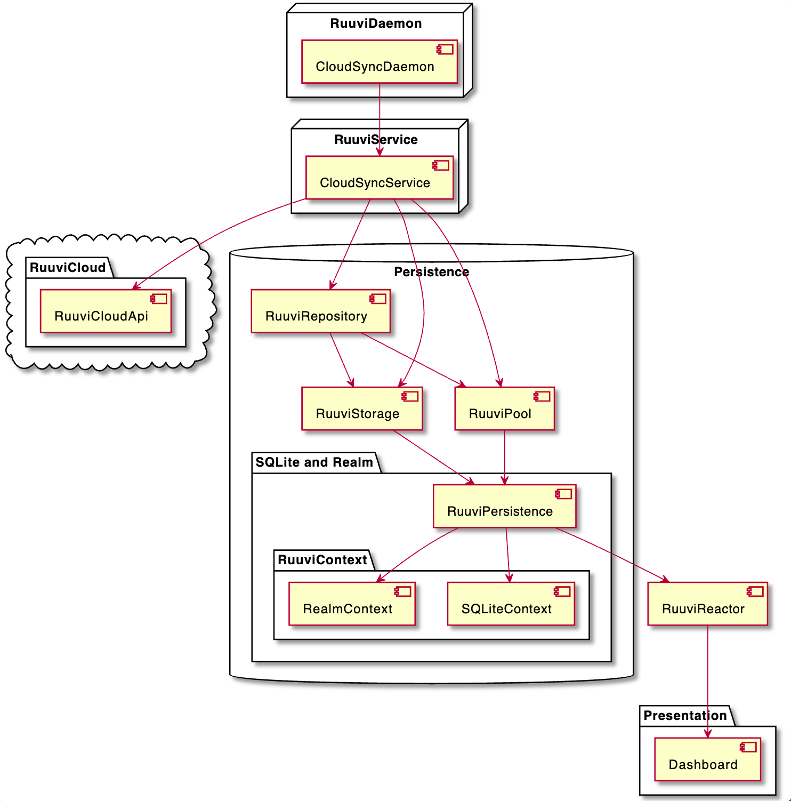
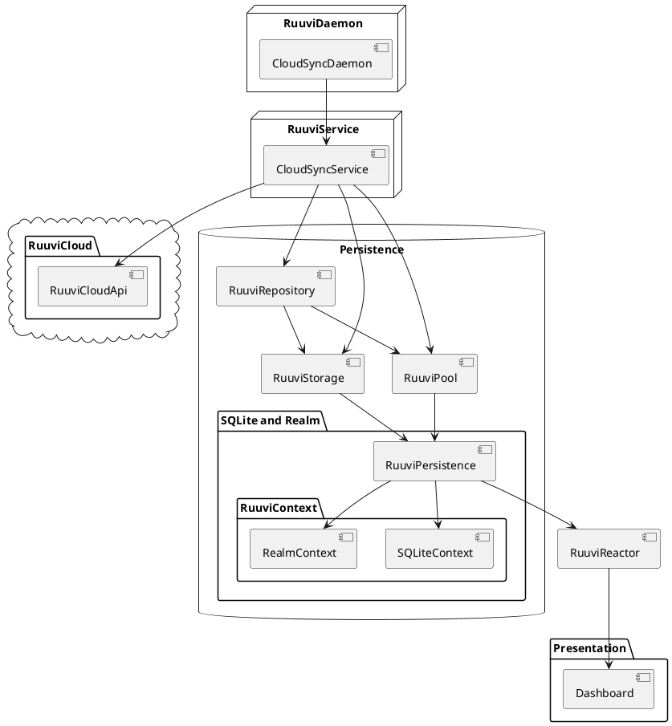

# CloudSync

The following diagram shows the process of [RuuviDaemon](../../Packages/RuuviDaemon/README.md) triggering the [RuuviService](../../Packages/RuuviService/README.md), which gets data from [RuuviCloud](../../Packages/RuuviCloud/README.md) and persists it in [RuuviRepository](../../Packages/RuuviRepository/README.md).

[RuuviRepository](../../Packages/RuuviRepository/README.md) triggers [RuuviReactor](../../Packages/RuuviReactor/README.md), and because the presentation layer is observing [RuuviReactor](../../Packages/RuuviReactor/README.md), it gets notified with new data came from `RuuviCloud`. 

